# 基于Vue+Node.js的药物相互作用查询系统的设计与实现

**Design and Implementation of a Drug Interaction Query System Based on Vue.js and Node.js**

---

## 基本信息

| 项目 | 内容 |
|------|------|
| **学生姓名** | 赵景南 |
| **学号** | 202241308 |
| **专业** | 信息管理与信息系统 |
| **指导教师** | 李清江 |
| **学院** | 公共卫生学院 |
| **日期** | 二○二六年六月 |

---

## 中文摘要

随着信息技术的迅速发展及医疗信息化程度的不断提高，社会的方方面面已经与互联网技术紧密地联系到了一起，在医疗领域，计算机技术的应用也显示出了其重要性。随着人们对健康的关注程度提高，药物信息管理的数字化需求也越来越大。

对医疗机构而言，药物信息管理是医疗服务质量的重要保障。对于患者而言，正确了解药物信息、避免药物相互作用是保障用药安全的关键。然而，传统的药物手册查阅方式存在药物信息分散、查询不便、相互作用检测困难等问题，已无法满足当前用户需求。

本系统基于Vue3前端框架和Node.js后端技术，采用前后端分离的B/S架构，设计并实现了一款药物相互作用查询系统。系统前端使用Vue3组合式API进行组件化开发，结合ECharts实现药物关系图谱的可视化展示；后端采用Koa框架搭建RESTful API服务，集成DeepSeek大模型实现AI智能问答功能；数据库采用MongoDB存储药物信息和相互作用数据。用户可以通过系统查询药物详细信息、检测多种药物之间的相互作用、查看药物关系图谱，还可以使用AI智能问答功能获取专业的药物知识。

本文通过研究基于Vue+Node.js的开发方法，借助VS Code开发平台、Vue3、Node.js、MongoDB等技术，实现具体功能模块的程序编写和对数据库的读写操作，设计了一款实用的药物相互作用查询系统。本系统使繁琐的药物信息查询变得更加简单、快捷，致力于大幅提升医疗机构药学服务水平、减轻药师的工作负担，同时保障患者的用药安全。

此外，本文在系统工程化方面也进行了深入实践，包括后端统一异常处理中间件、日志模块、接口分层规范、环境配置管理以及 Docker 化部署支持。通过这些设计，系统不仅满足了功能可用性，也提升了可维护性和可扩展性。结合测试结果可见，该系统能够在常见业务场景下稳定运行，并具备进一步拓展到移动端与多数据源融合的能力。

在研究与实现过程中，本文遵循“需求驱动—架构先行—模块迭代—测试验证”的工程路径：首先通过实际用药场景抽取核心需求，明确“查得快、判得准、看得懂、问得明白”四类目标；其次在系统设计阶段引入分层架构与接口规范，降低前后端耦合；随后围绕药物查询、交互检测、关系图谱与AI问答四大核心能力进行迭代开发；最后通过功能测试、异常测试与典型业务场景回放验证系统可用性。该过程强调了设计类课题中“理论依据与工程落地并重”的方法论价值。

本文还结合可持续演进视角，对系统后续扩展提出了可执行方向：如引入标准术语体系（ATC、RxNorm映射思路）、构建可追溯的问答证据链、完善日志与质量监控机制等。这些内容使系统不仅能够完成毕业设计阶段的目标，也具备面向真实业务环境持续演进的基础。

**关键词：** Vue3；Node.js；药物相互作用；Koa框架；MongoDB

---

## Abstract

With the continuous development of medical informatization and Internet technologies, drug information services are shifting from traditional manual lookup to intelligent online systems. However, in practical scenarios, users still face problems such as fragmented drug information, inefficient retrieval, and difficulty in identifying potential drug-drug interactions in time.

To address these issues, this project designs and implements a drug interaction query system based on Vue3 and Node.js. The system adopts a front-end/back-end separated B/S architecture. The front end is built with Vue3 and TypeScript, while the back end is implemented with Node.js and Koa. MongoDB is used to store drug data and interaction records. In addition, an AI service based on a large language model is integrated to provide natural-language pharmaceutical Q&A support.

The implementation covers core modules including drug search, interaction detection, relationship graph visualization, and AI-assisted consultation. The project also introduces engineering practices such as layered backend architecture, error handling middleware, request encapsulation, and deployment scripts. The results show that the system can effectively improve query efficiency and assist medication safety management.

From an implementation methodology perspective, this study follows a requirement-driven and iteration-oriented process: identifying real-world medication safety scenarios, defining system boundaries, building a decoupled front-end/back-end architecture, and validating outcomes through multi-dimensional testing. The design emphasizes practical applicability, maintainability, and extensibility rather than single-function delivery.

In addition, this work discusses future-oriented enhancements such as standardized terminology alignment, retrieval-augmented AI answers, and stronger observability mechanisms. Therefore, the proposed system not only fulfills the academic project objectives, but also provides a feasible foundation for future deployment in broader healthcare information contexts.

**Key Words:** Vue3; Node.js; Drug Interaction; Koa; MongoDB

---

## 第一章 绪论

### 1.1 研究背景

随着信息技术的迅速发展及医疗信息化程度的提高，医疗行业焕发了新的生机。推动医疗健康发展的一个重要因素就是信息技术，药物信息系统就是信息技术在医疗行业应用的一个体现。国外已经有比较先进的药物信息管理系统，并且在各医院得到了普及。

在美国，DrugBank数据库是一个知名的药物信息数据库，它提供了全面的药物数据，包括药物相互作用、靶点信息等。同时，美国的医院药剂科管理系统可以通过网页和移动应用程序进行访问，药师和患者可以通过系统查询药物信息和检测药物相互作用。同时，美国还建立了严格的用药安全指导流程，为患者提供详细的用药指导，以确保用药的安全进行。

在欧洲，许多国家也在积极推进医疗信息化建设。英国的NHS（国家医疗服务体系）建立了统一的药物信息系统，实现了不同医疗机构之间的药物信息共享。

随着社会的进步和人们对健康的关注程度提高，医疗资源的管理和用药安全问题显得日益突出。对于患者而言，传统的查阅药物手册方式已经不能满足其需求，药物信息分散、查询不便、相互作用检测困难等问题也制约了患者的用药安全和就医效率。因此通过基于Vue+Node.js的药物相互作用查询系统的设计和实现，可以从多个层面来改善和优化医疗服务，提高医患的体验，优化用药管理的流程，提高医院的服务水平，从而满足患者不同类型的需求和要求。

从实际业务场景看，慢病患者常存在“多药并用（Polypharmacy）”现象。例如高血压合并糖尿病患者在长期管理过程中，可能同时服用降压药、降糖药、调脂药及胃肠道保护药。若缺乏结构化的交互风险识别机制，医护人员与患者仅凭记忆或纸质资料难以及时判断潜在风险。该问题不仅影响诊疗效率，也可能增加不良反应发生概率。由此可见，构建一个可快速检索、可视呈现且可解释反馈的药物相互作用查询系统，具有明确的现实必要性。

同时，随着国家医疗信息化建设推进，医院、药房、基层医疗机构对“标准化数据+智能化分析”的需求不断增强。相较传统单一查询系统，融合图谱可视化与自然语言问答能力的新一代系统更能降低专业门槛，帮助不同角色用户在同一平台上完成信息获取与风险判断。这也为本课题提供了充分的研究价值和应用空间。

### 1.2 研究目的及意义

#### 1.2.1 研究目的

针对医疗机构的药物信息管理存在数据分散、查询不便等问题，对临床用药安全缺乏有效信息化支撑的不合理现象亟需提升医疗机构信息化水平，利用先进的药物相互作用查询系统来解决问题。为了提高医院药学服务的效率和患者的用药安全。通过系统化的药物信息管理，可以减少患者用药风险，并且可以提供药物查询、相互作用检测、图谱可视化等功能，方便医务人员和患者进行用药查询。

进一步而言，本课题的研究目的可细化为四个可落地目标：

1. **构建统一的数据查询入口**：将药物基础信息、相互作用信息与智能问答能力整合到同一业务系统，减少信息检索路径；
2. **建立可解释的风险提示机制**：不仅给出“是否存在相互作用”，还提供风险等级、作用机理说明与用药建议；
3. **提升复杂关系理解效率**：通过图谱方式展示药物网络关系，帮助用户从“列表阅读”转向“结构化理解”；
4. **形成可复制的工程实现范式**：沉淀前后端分离、接口分层、日志与异常治理、容器化部署等实践经验，支撑后续扩展。

#### 1.2.2 研究意义

研究基于Vue+Node.js的药物相互作用查询系统的设计与实现有利于提高医疗行业的药学服务水平，改善患者的用药安全体验。通过系统的药物信息管理，可以减少用药错误的风险，提高患者的满意度；同时，医疗机构可以通过系统管理药物信息，提高药师的工作效率，提高医院的服务质量。研究基于Vue+Node.js的药物相互作用查询系统的设计与实现，可以为医疗行业提供一种有效的解决方案，并为今后的医疗信息化提供借鉴。同时，使用Vue3作为前端框架可以提高开发效率，Node.js作为后端具有高并发处理能力，MongoDB作为数据库具有良好的可扩展性。

本课题的意义还体现在以下三个层面：

- **实践层面：** 通过将“药物查询+风险检测+可视化+AI问答”融合，形成完整闭环，直接服务于临床辅助与患者自助查询场景；
- **技术层面：** 验证了 Vue3 + Node.js + MongoDB 在医疗信息服务场景中的可行性与工程效率，体现了前后端分离架构在迭代开发中的优势；
- **教学与研究层面：** 为信息管理类专业学生在“业务问题抽象—系统架构设计—工程实施—测试评估”全过程中提供可参考模板，具有较强示范意义。

### 1.3 国内外研究现状

目前，在国内已经有很多医院和医疗机构采用B/S架构开发药物信息管理系统。这些系统主要包括药物信息查询系统、药物相互作用检测系统、药品库存管理系统等。

2021年，基于Web的药物信息管理系统的研究与实现，采用Vue.js作为前端框架、Node.js作为后端开发了一个药物信息管理系统，实现了药物信息查询、库存管理等功能。2022年，智能药物相互作用检测系统的设计与实现，采用深度学习技术实现了药物相互作用的智能预测。

采用Vue3技术和Node.js开发的药物相互作用查询系统，是当前我国医疗卫生事业发展的一个主要的趋势。未来，基于Web的药物相互作用查询系统也将会进一步改进和完善，实现更多的功能，以满足医务人员和患者的多样性需求，提高医院的工作效率和服务质量。

在国外，药物信息管理系统已经取得了显著的发展。美国作为医疗信息化的先驱，建立了多个权威的药物信息数据库和管理系统。DrugBank是其中最具代表性的药物数据库，包含了丰富的药物化学、药理学和药物相互作用信息。美国医院普遍采用电子处方系统和药物信息管理系统，大大减少了用药错误的发生。

英国的NHS系统建立了覆盖全国的药物信息共享平台，实现了不同医疗机构之间的药物信息互联互通。德国的医疗信息系统则注重药物经济学分析，为医疗决策提供数据支持。

这些发达国家的研究表明，完善的药物信息管理系统能够有效降低医疗成本、减少用药错误、提高医疗服务质量，是医疗信息化建设中不可或缺的重要组成部分。

综合国内外研究可进一步发现：现有系统虽在“数据覆盖度”和“查询能力”上已取得进展，但在“面向普通用户的可解释交互”方面仍有提升空间。具体表现为：

1. 多数系统强调专业人员使用场景，普通患者理解门槛较高；
2. 结果输出偏向静态文本，缺少关系结构的可视化支持；
3. 智能问答能力逐步引入，但答案与结构化数据库之间的联动与追溯机制仍不完善。

因此，本课题在借鉴现有成果的基础上，选择将可视化图谱与AI问答协同设计，并通过统一接口层连接结构化数据库与自然语言服务，力图在“可用性、可解释性、可扩展性”之间取得平衡。

### 1.4 本文研究的主要内容

本文主要研究基于Vue+Node.js的药物相互作用查询系统的设计与实现，主要研究内容包括以下几个方面：

（1）系统架构设计：对系统的整体架构进行设计，包括前端Vue3应用、后端Koa服务、数据库三层架构，以确保系统的高效运行。

（2）用户界面设计：对系统的用户界面进行设计，使用Vue3组件化开发，确保系统易于使用且界面美观。

（3）药物数据库设计：设计药物信息数据库，存储药物名称、分类、副作用、禁忌症等信息，并建立药物相互作用关系。

（4）可视化图谱设计：使用ECharts实现药物关系图谱的可视化展示，直观呈现药物之间的相互作用关系。

（5）AI智能分析：集成DeepSeek大模型，实现药物信息的智能分析和问答功能。

（6）系统的实现与测试：实现了基于Vue+Node.js的药物相互作用查询系统，依据系统设计的结果对系统进行实现，在系统实现后对其进行测试，并对测试中发现的问题进行了修正和优化。

（7）工程化与部署方案：结合 Monorepo 结构，形成前后端协同开发流程，支持本地开发、脚本化部署与容器化部署，提升系统落地能力。

为保证研究过程完整、结果可复现，本文还给出明确的技术实施路线：

- **阶段一：需求梳理与边界定义。** 基于典型用药场景梳理功能需求、非功能需求和数据边界；
- **阶段二：总体架构与模块划分。** 明确前后端职责、接口规范、数据模型和异常处理策略；
- **阶段三：核心功能实现。** 依次实现药物查询、交互检测、图谱展示和AI问答模块；
- **阶段四：测试与优化。** 通过多维度测试验证系统质量，并针对性能与体验进行迭代。

上述路线确保课题工作不仅停留在功能实现层面，更体现“可分析、可实现、可验证、可扩展”的设计类文档规范要求。

---

## 第二章 系统开发理论基础

### 2.1 系统结构模式

系统采用了前后端分离的三层B/S结构模式，整体系统架构分为：

**1. 浏览器层（前端，Vue3）**

使用 Vue3 构建 SPA（单页应用），负责用户界面展示与交互，包括首页、药物查询、相互作用检测、药物图谱和 AI 问答等模块。通过 HTTP/REST API 与后端通信，前端只处理数据展示和用户操作，不直接处理业务逻辑和数据存储。

**2. Node.js服务器层（后端，Koa）**

使用 Node.js + Koa 框架搭建后端应用，对外提供 RESTful API，处理客户端请求。后端结构分为四大部分：Controllers（控制器）、Services（业务服务）、Routes（路由）、Middleware（中间件），体现高内聚低耦合设计理念。集成 DeepSeek 大模型，实现 AI 药品智能问答功能。负责与数据库的数据交互，例如药物信息维护与查询、药物相互作用检索等。

**3. 数据库服务器层（MongoDB）**

采用 MongoDB 作为主数据存储，负责药物信息与相互作用信息的管理。用 Mongoose 作为 ODM，便于 Node.js 程序与 MongoDB 数据结构对接。

**层间通信：**

前端通过 REST API 调用后端服务，发送/接收 JSON 格式数据。后端通过 MongoDB 驱动与数据库直接交互，或通过 DeepSeek API 完成 AI 服务调用。

**系统总体架构图：**

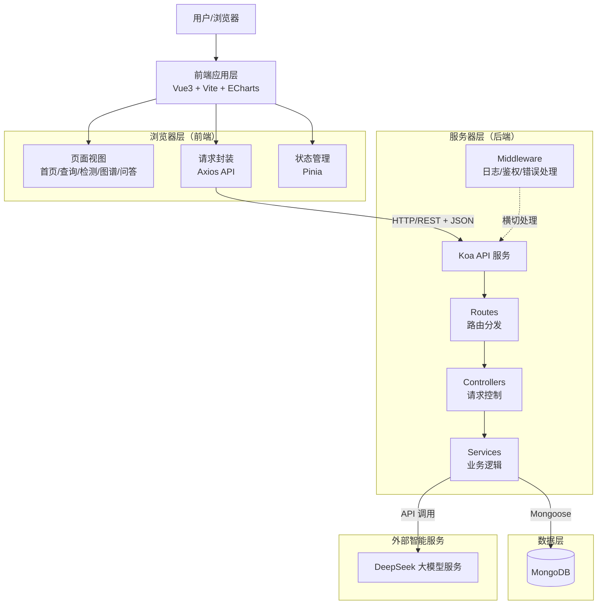

从项目结构上看，前端位于 `apps/frontend`，后端位于 `apps/backend`，公共工程配置集中在仓库根目录，形成较清晰的职责边界。后端目录中 `controllers`、`services`、`models` 与 `routes` 分别对应请求控制、业务处理、数据模型与路由分发，便于后续功能扩展和团队协作开发。

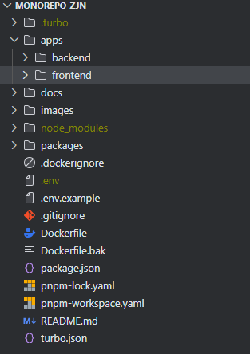

图2-1 Monorepo项目目录结构

在该结构模式下，系统通过“高内聚、低耦合”的方式组织代码：前端关注交互呈现与状态流转，后端关注业务规则与数据一致性，数据库关注持久化与查询效率。这种分工不仅便于单模块独立演进，也使得部署、排错和性能优化具备更好的可操作性。

此外，系统采用统一的响应结构（如状态码、消息、数据体）与错误处理策略，能够减少前端适配成本，并提升接口可维护性。在设计类项目中，这类“规范先行”的工程实践是保障系统长期稳定的重要前提。

### 2.2 关键技术与设计原理

为支撑系统功能目标，本课题在技术选型上遵循“匹配业务特征、兼顾开发效率、保证后续扩展”的原则。关键技术及其设计原理如下：

**（1）Vue3 组合式API：**

采用组合式API进行前端开发，便于按业务能力组织逻辑（如查询逻辑、图谱逻辑、问答逻辑），提高代码复用度和可维护性。其响应式机制可在数据变化时驱动视图自动更新，适合交互频繁的查询类应用。

**（2）Koa 异步中间件模型：**

Koa基于中间件洋葱模型处理请求，能够将日志、鉴权、参数校验、错误捕获等横切逻辑进行统一封装。该模式有助于减少控制器重复代码，提高后端结构清晰度。

**（3）MongoDB 文档存储模式：**

药物信息与相互作用数据具备一定的半结构化特征，文档数据库能够更灵活地支持字段扩展。结合索引策略，可在常见查询场景下提升检索效率。

**（4）ECharts 关系图谱可视化：**

将药物作为节点、相互作用作为边构建网络图，利用颜色和线型映射风险等级，帮助用户从整体视角理解复杂关系。该方式相比纯表格结果更具解释力，尤其适用于多药联合分析场景。

**（5）AI 大模型问答编排：**

系统通过后端服务封装模型调用过程，实现提示词构建、上下文管理与结果返回。该能力用于补充结构化查询的表达边界，使用户可通过自然语言获取更友好的说明。

### 2.3 本章小结

本章从系统结构模式和关键技术原理两个方面，为后续章节的详细设计提供理论支撑。通过前后端分层、统一接口规范与可视化+智能化协同设计，系统具备了较好的工程可行性与持续演进能力。

---

## 第三章 系统整体分析

### 3.1 系统需求分析

药物相互作用查询系统旨在帮助医务人员与患者便捷、准确地查询药物信息及药物间的相互作用情况，提高用药安全和药学服务效率。主要功能需求包括：

- 用户（普通或医疗工作者）须能随时随地高效查询药物信息及交互风险，结果内容准确权威
- 查询、检测结果须基于标准药物数据库，具备科学性
- 提供统一的数据访问接口与基础校验机制，保障系统数据安全
- 系统界面友好易用，支持移动端/网页端访问
- 提供高并发、稳定的数据查询和AI解答能力

在非功能需求方面，系统还应满足：

- **可用性要求：** 页面操作路径简洁、提示信息明确、错误反馈友好；
- **可维护性要求：** 代码结构清晰，模块边界明确，便于后续迭代；
- **可扩展性要求：** 支持新增药物字段、风险规则与第三方数据源接入；
- **安全性要求：** 关键接口具备参数校验能力，降低非法输入与注入风险。

在需求分析方法上，本文采用“用户角色—业务场景—功能拆解—约束补充”的分析路径：先明确用户类型（患者、药师），再抽取典型业务流程，最后映射到系统功能与非功能指标。这种方式可避免仅从技术视角出发导致的需求失真问题。

图3-1 系统需求梳理结果示意

**需求分析流程图：**

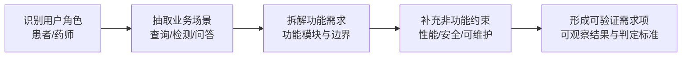

为提升需求可验证性，系统将关键需求转化为可观察结果，例如：

- 当用户输入药物名称时，系统应在可接受时间内返回候选与详情；
- 当用户提交多药组合时，系统应给出风险分级与说明；
- 当用户进入图谱页面时，系统应可视展示关键关系并支持交互；
- 当用户提出自然语言问题时，系统应返回结构清晰、语义可读的答复。

#### 3.1.1 功能需求分析

**1. 药物查询模块：** 用户可输入药物名称，查询药物的详细信息，包括：药物名称、通用名称、分类描述、副作用、禁忌症等。

**2. 相互作用检测模块：** 用户可同时选择多种药物，系统检测这些药物间是否存在相互作用。系统应返回相互作用的详细信息，风险等级（如高/中/低），用药建议。

**3. 药物图谱模块：** 以直观的图谱方式（ECharts）展示药物间的关系网络。用户可通过图谱查看药物之间的相互作用。

**4. AI智能问答模块：** 集成 DeepSeek 大模型等 AI 服务。用户可以以自然语言提问药物相关问题，系统自动给出专业答案。

除上述核心功能外，系统还补充以下辅助功能以提升完整性：

- **统一异常提示机制：** 当前端请求失败、参数缺失或服务异常时，系统应向用户反馈明确错误信息，避免“无响应”体验；
- **分页与筛选机制：** 对药物列表提供分页、关键字过滤与条件检索，提升大数据量场景下的可用性；
- **日志与审计能力：** 后端记录关键操作与异常信息，便于运维排查和管理行为追踪。

以“多药相互作用检测”场景为例，功能流程可进一步细化为：

1. 用户在前端多选药物并提交；
2. 后端校验药物ID合法性与去重规则；
3. 服务层执行组合匹配并计算风险优先级；
4. 控制层返回标准化响应；
5. 前端按风险等级进行分组展示与颜色标注。

#### 3.1.2 系统性能分析

**1. 响应速度：** 前端采用Vue3和ECharts，具备优秀的数据渲染和图形可视化能力，支持组件按需加载与响应式视图更新，保证界面交互流畅。后端采用Node.js的Koa框架，具备异步非阻塞特性，处理请求的延迟低，大多数业务API接口响应时间可以控制在数百毫秒以内。数据库使用MongoDB，基于内存计算和高效的文档型存储，常用的药物信息查询和关系检索场景可实现毫秒级返回。

**2. 并发处理能力：** Node.js天然适合I/O密集型高并发应用，能高效应对大批量药物信息的并发检索、交互和AI问答请求。前后端分离架构支持静态资源CDN部署和REST API水平扩展，有利于提升整体并发能力。MongoDB支持分片与副本集机制，可进一步提升数据库高并发读写与高可用能力。

**3. 可扩展性：** 采用Monorepo和微服务思想管理，实现前后端各自独立扩展和运维。业务逻辑、接口服务、AI能力以及数据存储层均可通过集群部署、微服务拆分等方式扩展，便于后续功能拓展与流量扩容。代码规范化、组件化开发支持功能模块灵活复用和升级。

**4. 可靠性与容错性：** 后端设计有异常处理中间件，能够对数据库访问、API调用、AI推理等场景中的异常进行捕捉与写日志，提升系统健壮性。依赖的MongoDB数据库支持自动备份、数据恢复操作，减少因数据故障导致的服务不可用风险。前端异常情况有错误提示机制，提升用户体验。

**5. 安全性：** API请求参数进行校验，减少注入风险。药物数据变更接口进行输入校验与操作约束，防止数据被恶意篡改。支持CORS中间件、HTTPS安全协议、数据库访问权限控制等安全机制，保障系统与数据安全。

**6. 可维护性：** 采用模块化开发与文档注释，便于后续迭代和维护。使用现代化工具链、包管理与测试体系，提高代码质量和运维效率。

为使性能分析更具工程指导意义，可从“感知性能、系统吞吐、稳定性恢复”三个维度理解：

- **感知性能：** 关注用户实际体验，包括首屏加载、交互反馈、结果呈现速度；
- **系统吞吐：** 关注并发请求下的接口处理能力与数据库读写效率；
- **稳定性恢复：** 关注异常出现后系统是否能够快速降级并保持核心功能可用。

在本项目中，前端通过懒加载、请求节流与状态提示优化感知性能；后端通过异步处理、服务分层和统一异常拦截保障吞吐与稳定性；数据库通过索引与查询优化降低热点接口延迟。该组合策略能够较好支撑药物查询类业务的常见访问模式。

### 3.2 典型业务场景分析

为增强需求与设计之间的可追溯性，本文选取两个典型场景进行说明。

**场景A：门诊药师进行联合用药审核**

- 输入：处方中涉及的多个药物名称；
- 处理：系统自动识别药物间交互关系并给出风险等级；
- 输出：按高、中、低风险分层展示，附带简要用药建议；
- 价值：缩短人工检索时间，提升审核效率与一致性。

**场景B：患者自主查询药物注意事项**

- 输入：患者通过自然语言提问（如“这个药能和降压药一起吃吗？”）；
- 处理：后端整合结构化数据与模型回答生成易理解内容；
- 输出：返回面向非专业用户的解释性答复，并提示就医建议边界；
- 价值：降低信息理解门槛，提升患者用药安全意识。

### 3.3 本章小结

本章从需求、功能、性能和场景四个层面完成系统整体分析，明确了系统建设目标与约束条件，为后续总体设计和详细实现奠定了可验证的分析基础。

---

## 第四章 系统总体设计

### 4.1 系统功能模块的设计

本系统采用典型的前后端分离模式，整体功能划分清晰，模块结构合理，符合现代Web应用开发的主流架构。系统主要功能模块如下：

在模块设计层面，系统遵循以下原则：

- **单一职责原则：** 每个模块聚焦单一业务目标，降低模块间耦合；
- **可扩展原则：** 通过统一接口与配置化策略，支持后续功能平滑迭代；
- **一致性原则：** 统一交互反馈、状态展示与异常提示，降低学习成本；
- **可追溯原则：** 核心操作具备日志记录，便于问题定位与过程审计。

基于上述原则，系统将“用户可见功能”与“系统支撑能力”分层设计：前者包括查询、检测、图谱、问答等业务模块；后者包括请求封装、权限校验、日志与异常治理等基础模块。两类模块协同构成完整系统能力。

**1. 首页模块**

系统入口页面，向用户展示项目简介、核心价值、导航功能等，作为各功能模块的统一跳转入口。包括Logo、导航栏、功能卡片、项目信息等。

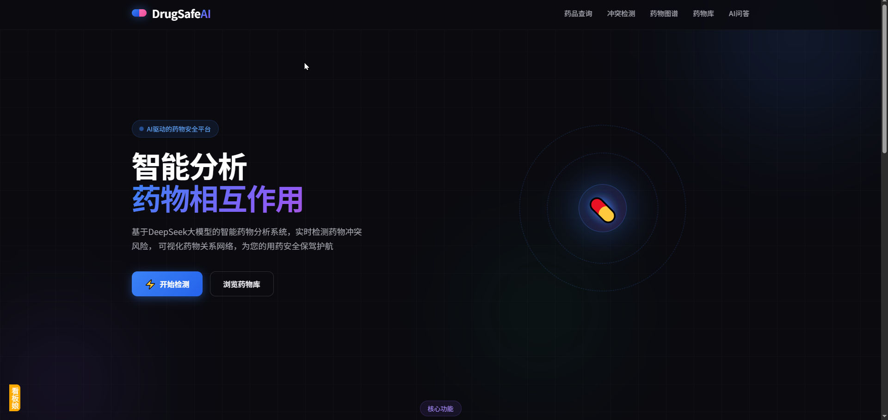

图4-1 系统首页界面

**2. 药物查询模块**

为用户提供药物基础信息的搜索与浏览服务。支持模糊/精确检索药物名称、通用名。返回药物的详细信息（如类别、作用机制、副作用、用药禁忌等）。前端以列表/卡片形式展示查询结果。支持药物详情的弹窗式展开查看。

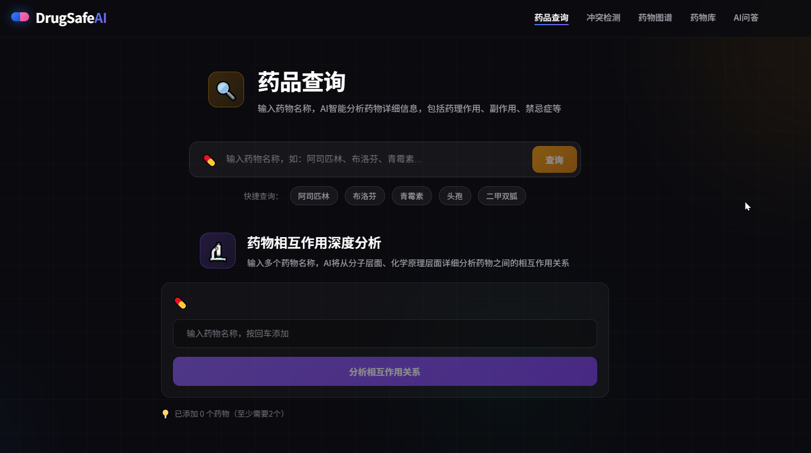

图4-2 药物查询模块界面

**3. 相互作用检测模块**

帮助用户检测多种药物联合用药时是否存在相互作用，并给出风险提示和用药建议。实现方式为多选框（或搜索型下拉）选择多个药物组合。检测选定药物间的所有交互情况（基于后端数据库匹配相互作用规则）。展示交互结果，包括相互作用类型、风险等级、详细说明和建议。对无交互情况给出友好提示。

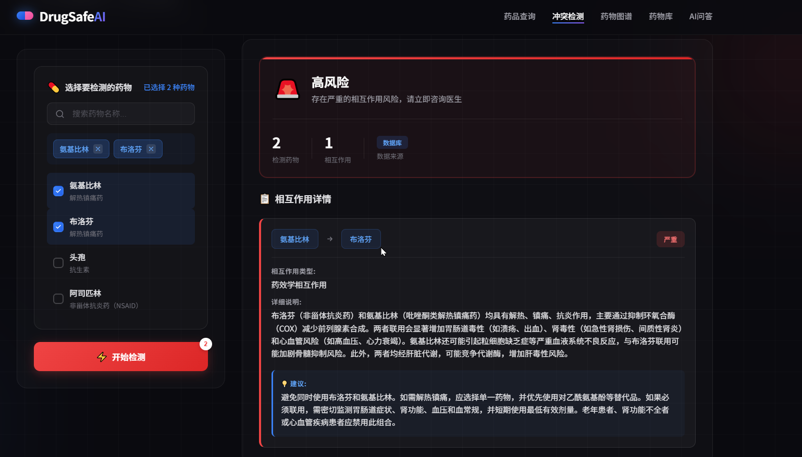

图4-3 相互作用检测模块界面

**4. 药物关系图谱模块**

以可视化方式呈现药物间复杂的相互作用网络关系，便于直观理解和纵览全局。使用ECharts力导向图等高级可视化技术展示药物关系网络。图中节点表示药物，线表示交互关系，线条颜色区分风险等级。支持节点拖拽、画布缩放、节点悬浮查看详细信息等人机交互操作。

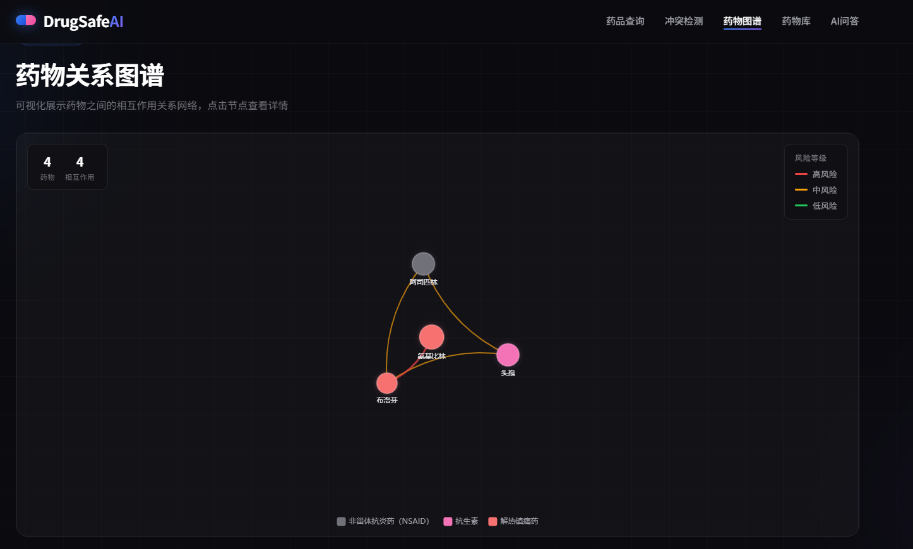

图4-4 药物关系图谱可视化界面

**5. AI智能问答模块**

集成AI大模型（如DeepSeek等），为用户提供自然语言输入药物知识问答和用药建议服务。用户可自由输入与药物相关的提问。后端调用AI模型自动理解并作答，输出专业语言回复。支持多轮连续问答，历史记录可追溯。

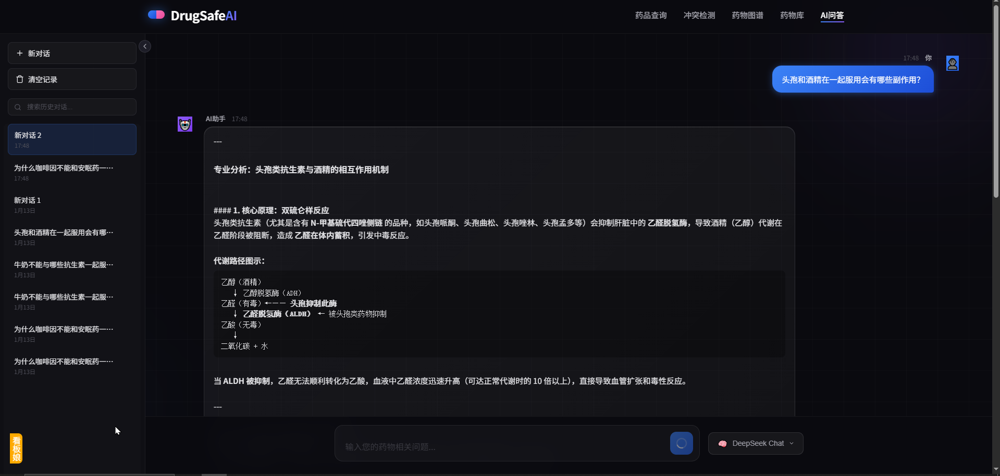

图4-5 AI智能问答模块界面

从用户视角看，上述模块分别对应“信息获取—风险判断—关系理解—知识解释”四条能力链路，能够覆盖普通用户与医务人员在常见用药场景下的核心需求。

### 4.1.1 系统架构设计及操作流程

本系统采用"前后端分离"三层体系架构（B/S架构），主要包括浏览器层（前端）、服务器层（后端）、数据库层三部分：

- **浏览器层（前端 Vue3）：** 负责用户界面展示与交互、数据请求与结果可视化。典型页面包括：首页、药物查询、相互作用检测、关系图谱、AI问答等。与后端通过HTTP/RESTful API进行数据通信。

- **服务器层（后端 Node.js + Koa）：** 负责编写API接口、业务逻辑处理、安全验证、AI问答编排等。

- **数据库层（MongoDB）：** 采用NoSQL文档数据库，存储药物信息、相互作用关系、用户数据等。支持高并发访问，数据格式灵活，便于模型扩展。

**用户访问流程：** 用户通过浏览器访问系统首页 → 通过导航栏选择具体功能（如药物查询、相互作用检测、图谱、AI问答）→ 前端发起请求，后端API接受、处理并返回数据 → 用户根据业务需求完成操作。

<!--  -->

<!-- 
图4-6 典型业务访问过程界面序列
 -->

**系统访问与处理主流程图：**

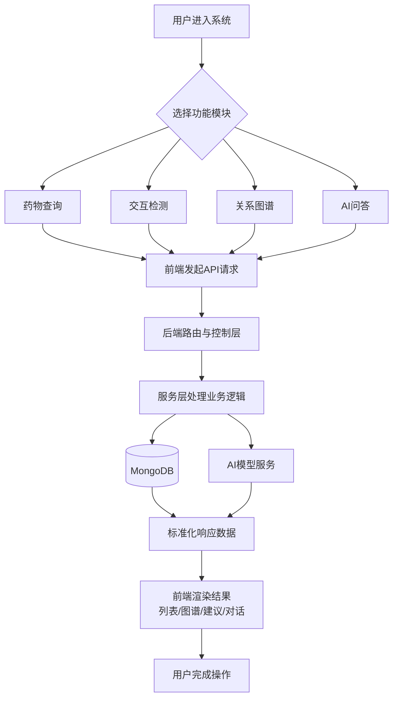

**核心业务模块操作流程：**
- 用户进入药物查询页面 → 输入/选择药物名称 → 前端发起API请求 → 后端查库并返回药物详情 → 前端展示药物详细数据
- 用户进入检测页面 → 选择多种药物 → 前端将选择结果提交后端 → 后端查询相互作用关系并返回风险评估/建议 → 前端展示检测结果
- 用户跳转至药物图谱页 → 前端请求药物/关系数据 → 绘制力导向图谱 → 用户可拖拽、点击节点交互
- 用户在AI问答页面输入自然语言问题 → 前端将问题发送后端 → 后端请求AI大模型/知识库，得到答案 → 前端展示问答对话

为提升用户体验，系统在前端交互中增加了加载状态、空结果提示与异常提示机制；在后端接口层增加统一响应结构，保证不同模块返回格式一致，降低前端适配复杂度。

进一步地，系统在操作流程中补充了异常分支设计：

1. **参数异常分支：** 若请求参数缺失或格式错误，后端返回可读错误信息并阻断后续处理；
2. **数据缺失分支：** 若未检索到目标药物或交互关系，前端展示“无结果”引导文案，避免误判为系统故障；
3. **服务降级分支：** 若AI服务临时不可用，系统优先返回结构化数据库信息，保证核心查询能力不受影响。

该流程设计体现“优先保障核心功能可用”的工程思想，有助于提升真实使用场景下的系统稳定性。

### 4.2 数据设计与接口设计要点

为保证前后端协同效率与数据一致性，系统在数据与接口层面采用如下设计要点：

**（1）数据字段标准化**

药物实体统一包含名称、分类、适应症、副作用、禁忌症等基础字段；相互作用实体包含药物对、风险等级、说明与建议字段。字段规范化有助于减少同义项歧义。

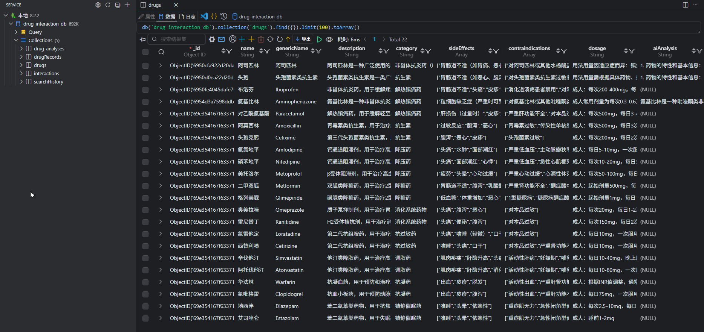

图4-7 数据库集合与字段结构示例

**（2）接口语义一致性**

查询类接口采用明确资源路径，检测类接口采用动作语义路径，返回体统一包含状态、消息与数据主体，便于前端通用处理。

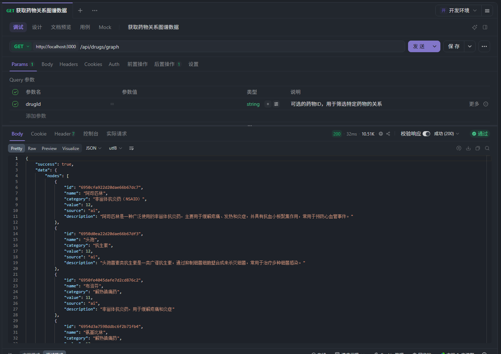

图4-8 接口调用与返回结果示例

**（3）风险等级映射策略**

将高/中/低风险等级映射为统一颜色与提示语体系，在列表、详情、图谱等多个界面保持一致，降低用户认知切换成本。

**（4）数据校验与去重策略**

在写入药物和相互作用记录时进行字段完整性校验与关键字段去重，避免冗余数据影响检测结果准确性。

### 4.3 本章小结

本章围绕系统总体设计给出了模块结构、流程机制和数据接口要点，形成了从“功能定义”到“实现约束”的完整设计闭环，为后续详细实现提供了工程化依据。

---

## 第五章 系统主要功能模块的详细设计与实现

### 5.1 公用模块设计

公用模块为整个系统提供基础能力，充分复用，保持代码整洁与维护高效：

**（1）统一布局与导航模块**

实现：使用 Vue3 实现统一的主布局组件，包括 Header（导航栏）、Footer（版权信息）、Sidebar（功能入口）。用户通过导航栏快速跳转到不同功能页面。

**（2）全局请求与接口处理模块**

实现：前端统一封装 Axios，用于所有模块发起 HTTP 请求，自动带 token 和错误处理。支持 Loading 动画与错误全局弹窗提示。拦截器处理 API 统一认证。

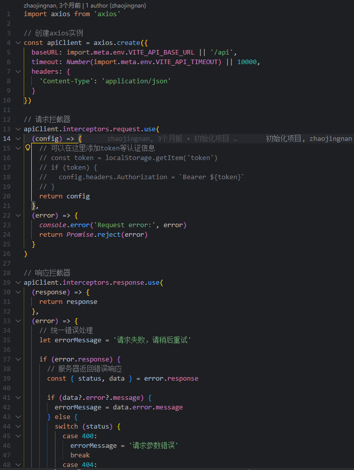

图5-1 前端统一请求封装实现

**（3）状态管理模块**

实现：使用 Pinia 作为全局状态管理，实现药物列表、用户信息等跨页面共享。

**（4）图形渲染与可视化封装模块**

实现：对 ECharts 图谱渲染参数进行统一封装，包括节点样式、风险等级颜色映射、交互提示格式等，保证图谱在不同页面中的视觉与交互一致性。

**（5）错误处理与日志模块**

实现：后端通过中间件集中捕获业务异常和系统异常，统一输出错误码与错误信息，并写入日志文件，便于后续排查问题。

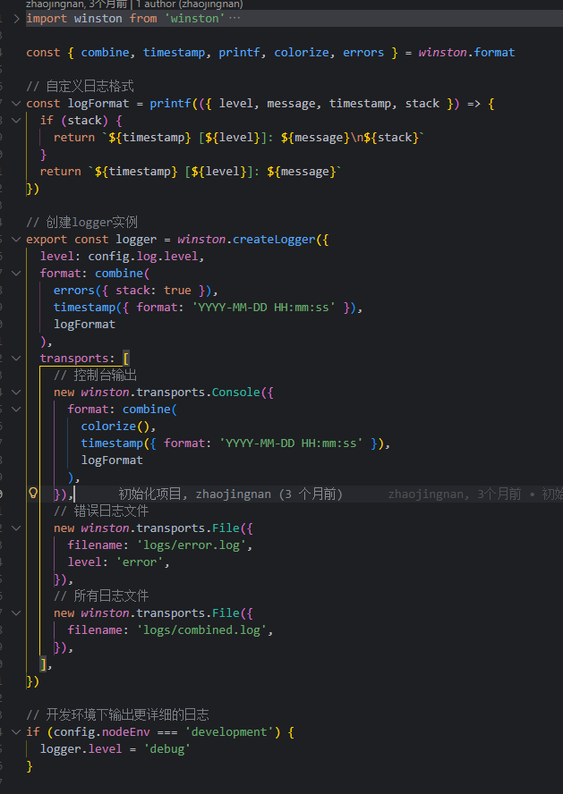

图5-2 后端统一异常与日志输出

为进一步说明可实施性，公用模块建设过程可概括为以下步骤：

1. **抽取共性能力：** 识别跨页面、跨业务重复逻辑（请求、状态、提示、鉴权）；
2. **统一封装入口：** 在前端建立统一API层，在后端建立统一中间件入口；
3. **定义规范约束：** 统一响应格式、异常格式、日志记录粒度；
4. **模块化接入业务：** 各业务模块以最小侵入方式复用公用能力；
5. **迭代优化体验：** 根据实际使用反馈优化提示文案、加载交互与异常展示。

该过程可有效避免“功能可用但维护困难”的常见问题，使系统在规模扩大时仍保持结构清晰。

在典型实现上，当前项目中前端 `api` 目录承担请求封装职责，后端 `middleware` 与 `utils/logger` 承担异常与日志治理职责，体现了“基础能力下沉、业务能力上浮”的分层思想。

### 5.2 数据维护与初始化实现

本项目不涉及独立管理界面，药物与相互作用数据的维护主要通过后端脚本与数据库操作完成。

**（1）初始化方式：** 通过种子数据脚本将药物基础数据与相互作用关系写入 MongoDB，确保系统可在开发与演示环境快速启动。

**（2）数据校验策略：** 对关键字段进行完整性检查与去重处理，避免重复记录影响检测结果。

**（3）维护流程：** 当需要更新数据时，先整理数据源，再执行脚本更新与校验，最后通过接口回放检查查询与检测结果是否符合预期。

### 5.3 核心模块实现示例（场景化说明）

为增强文档可读性与答辩展示效果，本文补充一个端到端实现示例：

**示例：用户进行多药相互作用检测**

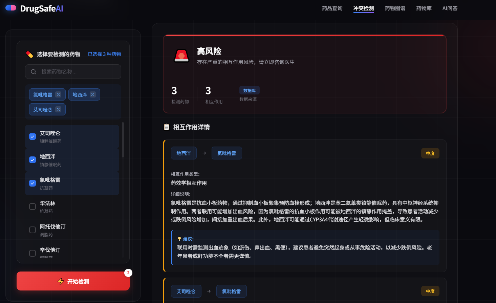

图5-6 多药相互作用检测结果展示

**多药相互作用检测流程图：**

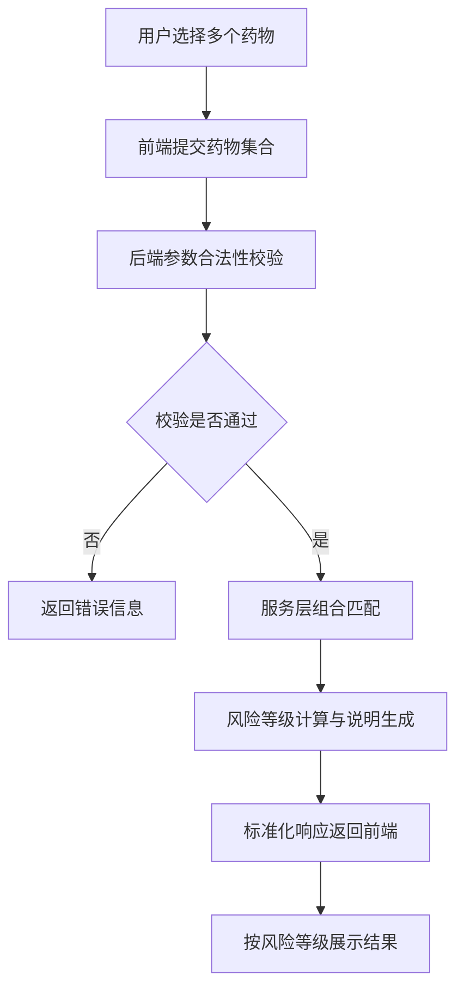

1. 前端组件收集用户选择的药物集合；
2. 请求层将数据发送至 `POST /api/interactions/check`；
3. 后端控制层接收请求并进行参数合法性校验；
4. 服务层执行药物组合匹配与风险整合；
5. 返回结构化结果（风险等级、说明、建议）；
6. 前端按风险等级渲染结果并提供交互提示。

该示例体现了从用户动作到系统反馈的完整链路，也验证了分层架构在复杂业务中的可维护优势。

### 5.4 本章小结

本章围绕公用模块与核心能力展开详细设计，补充了实施步骤与场景化实现说明，使“如何设计”与“如何落地”之间形成明确映射关系。

---

## 第六章 系统测试

### 6.1 系统测试工作的意义

系统测试是软件开发生命周期中不可或缺的环节，对于本药物相互作用查询系统，其测试工作的意义主要体现在以下方面：

- **验证系统的功能实现是否满足需求：** 通过测试，全面检验各项功能（如药物查询、交互检测、图谱显示、AI问答等）是否按照需求规范准确实现，满足用户的核心业务需求。

- **发现并修复系统潜在缺陷：** 测试可以揭示开发过程中难以发现的各种漏洞和缺陷，如逻辑错误、数据异常、界面交互瑕疵、性能瓶颈等，便于开发者及时修复，保障系统稳定运行。

- **提升软件质量与可靠性：** 经过严格系统测试，能够大大提升系统整体质量，增强稳定性和可靠性，减少系统在实际运行过程中出现故障概率，提升用户满意度和信任度。

- **保障用户数据和操作安全：** 测试环节验证了权限管理、数据校验、异常处理等机制，有效避免敏感信息泄露、越权操作等安全问题的发生。

- **为后续系统维护和升级打基础：** 通过标准测试用例、覆盖报告和缺陷记录，为系统后续迭代和新功能开发提供坚实基础，也利于团队知识传承与文档完善。

### 6.2 测试方法

**1. 功能测试（黑盒测试）**

目的：验证系统各模块的功能是否符合需求说明，无需关心具体代码实现细节。

图6-1 系统测试用例示例

实践：编写各功能场景的测试用例。如：药物查询、相互作用检测、图谱展示、AI问答等。

**2. 界面测试（UI/UX测试）**

目的：验证系统界面的规范性、易用性、美观性及协调性，提升用户体验。

实践：检查界面布局、按钮、输入框、弹窗等视觉一致性；检查页面跳转、交互动画、响应速度；检查提示信息友好性与错误反馈方式。

**3. 性能测试**

目的：检验系统在高并发、大数据量下的响应时间、吞吐量和资源消耗，预防卡顿和崩溃。

实践：多线程或工具模拟并发请求，检查API返回时间、前端页面渲染时长。

**4. 安全测试**

目的：保障数据安全和用户操作合法性，防止越权、注入、XSS等安全问题。

实践：测试登录与加密、敏感操作的权限限制；随机、不合法/恶意输入检验系统是否能正确拦截和报错。

**5. 兼容性测试**

目的：保证系统能适配主流操作系统、浏览器和不同终端设备。

实践：在Chrome、Firefox、Edge等多种浏览器下分别测试核心功能；尝试移动端访问与不同分辨率设备页面适应性。

**6. 回归测试**

目的：系统升级或Bug修复后，验证原有功能未被破坏。

实践：重新运行已有测试用例，确认新需求或补丁未引入新缺陷。

结合本项目目录中的测试脚本，可对后端服务模块进行基础验证，包括 AI 服务能力验证、药物查询服务验证、图谱服务验证、路由可用性验证等，从而形成“接口—服务—业务流程”三层测试覆盖。

### 6.3 测试实施过程与结果分析

为保证测试活动有序开展，系统测试按“测试准备—用例执行—问题修复—回归确认”进行。

**测试实施闭环流程图：**

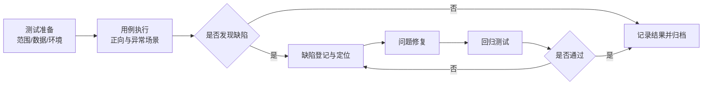

**（1）测试准备阶段**

- 明确测试范围：药物查询、交互检测、图谱展示、AI问答；
- 准备测试数据：覆盖常见药物组合、边界输入和异常输入；
- 搭建测试环境：前后端联调环境与数据库连接环境。

**（2）用例执行阶段**

- 按功能模块执行正向与逆向测试；
- 对关键接口进行异常输入验证（空值、非法值、重复值）；
- 对主要页面进行交互完整性验证（加载、提示、错误反馈）。

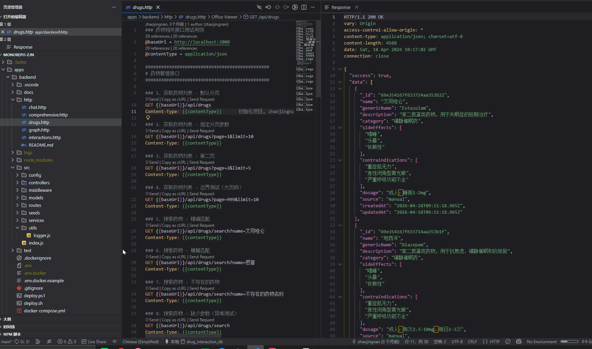

图6-2 测试执行结果统计

**（3）问题修复与回归阶段**

- 记录缺陷现象、触发条件与影响范围；
- 修复后重新执行关联用例，确认问题闭环；
- 对核心业务路径进行回归，确保修复未引入新问题。

图6-3 缺陷修复前后对比

从测试结果看，系统在常见业务路径下能够稳定完成查询与检测任务；在异常输入场景下可提供明确提示信息；在模块联动层面，接口返回与前端展示保持一致，满足毕业设计阶段的可用性目标。

### 6.4 测试经验与改进建议

通过本次测试实践，获得以下经验：

1. **应尽早引入场景化测试思维。** 相比仅测试单接口，完整业务链路测试更易暴露真实问题；
2. **异常路径与边界输入不可忽视。** 许多稳定性问题往往出现在“非理想输入”场景；
3. **日志是问题定位的重要抓手。** 统一日志结构能够显著提升故障排查效率。

后续可进一步引入自动化回归流水线、接口契约测试与压力测试，逐步提升测试深度和持续交付能力。

### 6.5 本章小结

本章系统说明了测试意义、测试方法与实施过程，并结合结果提出改进方向，为系统后续升级和工程化交付提供了质量保障依据。

---

## 第七章 总结与展望

### 7.1 总结

本文围绕基于Vue3和Node.js的药物相互作用查询系统的设计与实现展开。首先，对国内外医疗信息化、药物管理系统的研究现状进行了分析，总结出实际开发过程中的主要需求，包括药物信息查询、相互作用检测、药物关系可视化与AI智能问答等。随后，采用前后端分离架构，结合MongoDB数据库，设计了系统整体结构与功能模块，并进行了数据库建模。

在系统实现阶段，分别完成了基于pnpm monorepo技术的前后端环境搭建、前端Vue3+TypeScript+ECharts的功能开发，以及后端Koa+Mongoose+DeepSeek API的服务开发。系统测试结果表明，各核心业务模块运行稳定，能够满足目标用户的主要需求。

图7-1 系统成果总览

整个项目过程中，不仅加深了对现代前后端分离开发模式的理解，还将AI大模型技术有效集成于传统医疗信息服务中，提升了软件的智能化水平。该项目为药物管理、药学服务提供了创新的信息化解决方案，也在实践中积累了宝贵的设计与开发经验。

从设计研究视角看，本文的主要成果可归纳为三点：

1. 建立了以真实业务需求为导向的系统设计方法，明确了“查询—检测—可视化—问答”一体化能力框架；
2. 完成了可落地的工程实现路径，验证了Monorepo协同开发与分层架构在该类课题中的适配性；
3. 形成了可复用的文档化成果，包括需求分析、模块设计、流程说明、测试策略与优化方向，为后续迭代提供依据。

### 7.2 展望

虽然本系统实现了药物查询、相互作用检测、图谱可视化与AI智能问答等核心功能，基本满足了医院、药师及患者的需求，但仍存在一些不足和改进空间：

- （1）当前系统主要面向Web端，未来可以拓展至移动端（如微信小程序、APP），满足更多使用场景。
- （2）尚未实现完善的用户权限管理与注册登录功能，可通过OAuth2.0或JWT等技术提升系统安全性和用户体验。
- （3）数据主要来源于自建数据库，后续可考虑接入权威第三方数据源（如DrugBank等）以增强数据权威性和丰富性。
- （4）AI问答目前依赖于云端模型，未来可尝试本地化部署AI大模型以提升响应速度和隐私保护能力。
- （5）界面和交互还较为基础，有待进一步优化美观性和易用性，最终实现更加友好和高效的用户体验。
- （6）系统的可扩展性仍有提升空间，例如可考虑微服务架构、前端微模块化等先进技术以支持更大规模的用户访问和后期功能演进。

- （7）可进一步引入知识库检索增强（RAG）机制，将系统内置药物数据与大模型回答进行融合，提高回答可追溯性与专业性。

综上，基于Vue3与Node.js的药物相互作用查询系统不仅具备实际应用价值，还有广阔的后续改进和研究空间。下一步将不断丰富系统功能、优化架构，为医疗信息化发展提供持续的技术支持和实践探索。

从中长期规划看，系统可分“三阶段”持续演进：

- **短期（功能完善）：** 完成数据质量治理、核心接口文档规范化；
- **中期（能力增强）：** 引入检索增强问答、权威数据源对接、移动端适配；
- **长期（生态扩展）：** 探索与医院信息系统（HIS）、电子病历系统（EMR）协同，形成更完整的药学信息服务能力。

通过分阶段建设策略，系统能够在控制实施风险的前提下逐步提升业务价值与工程成熟度。

---

## 参考文献

[1] Vue.js Team. Vue.js Documentation[EB/OL]. [2026-04-18]. https://vuejs.org/.

[2] Vite Team. Vite Documentation[EB/OL]. [2026-04-18]. https://vitejs.dev/.

[3] Pinia Team. Pinia Documentation[EB/OL]. [2026-04-18]. https://pinia.vuejs.org/.

[4] Axios Team. Axios Documentation[EB/OL]. [2026-04-18]. https://axios-http.com/.

[5] Node.js Foundation. Node.js Documentation[EB/OL]. [2026-04-18]. https://nodejs.org/docs/.

[6] Koa Team. Koa Documentation[EB/OL]. [2026-04-18]. https://koajs.com/.

[7] MongoDB Inc. MongoDB Manual[EB/OL]. [2026-04-18]. https://www.mongodb.com/docs/manual/.

[8] Mongoose Team. Mongoose Documentation[EB/OL]. [2026-04-18]. https://mongoosejs.com/docs/.

[9] Apache ECharts Team. ECharts Documentation[EB/OL]. [2026-04-18]. https://echarts.apache.org/.

[10] DeepSeek. DeepSeek API Docs[EB/OL]. [2026-04-18]. https://api-docs.deepseek.com/.

[11] Fielding R T. Architectural Styles and the Design of Network-based Software Architectures[D]. Irvine: University of California, 2000.

[12] Richardson L, Ruby S. RESTful Web Services[M]. Sebastopol: O’Reilly Media, 2007.

[13] OpenAPI Initiative. OpenAPI Specification v3.1.0[EB/OL]. [2026-04-18]. https://spec.openapis.org/oas/v3.1.0.

[14] Fielding R, Nottingham M, Reschke J. RFC 9110: HTTP Semantics[S/OL]. IETF, 2022[2026-04-18]. https://www.rfc-editor.org/rfc/rfc9110.

[15] Bray T. RFC 8259: The JavaScript Object Notation (JSON) Data Interchange Format[S/OL]. IETF, 2017[2026-04-18]. https://www.rfc-editor.org/rfc/rfc8259.

[16] ECMA International. ECMA-262: ECMAScript Language Specification[EB/OL]. [2026-04-18]. https://tc39.es/ecma262/.

[17] Microsoft. TypeScript Handbook[EB/OL]. [2026-04-18]. https://www.typescriptlang.org/docs/.

[18] World Health Organization. Medication Without Harm[R/OL]. Geneva: WHO, 2017[2026-04-18]. https://www.who.int/publications/i/item/WHO-HIS-SDS-2017.6.

[19] World Health Organization. Medication Safety in Polypharmacy: Technical Report[R/OL]. Geneva: WHO, 2019[2026-04-18]. https://www.who.int/publications/i/item/WHO-UHC-SDS-2019.11.

[20] World Health Organization. Medication Safety in Transitions of Care[R/OL]. Geneva: WHO, 2019[2026-04-18]. https://www.who.int/publications/i/item/WHO-UHC-SDS-2019.9.

[21] World Health Organization. Medication Safety in High-risk Situations[R/OL]. Geneva: WHO, 2019[2026-04-18]. https://www.who.int/publications/i/item/WHO-UHC-SDS-2019.10.

[22] World Health Organization. Medication Safety for Look-alike, Sound-alike Medicines[R/OL]. Geneva: WHO, 2023[2026-04-18]. https://www.who.int/publications/i/item/9789240058897.

[23] World Health Organization. Medication Without Harm: Policy Brief[R/OL]. Geneva: WHO, 2024[2026-04-18]. https://www.who.int/publications/i/item/9789240062764.

[24] Wishart D S, Knox C, Guo A C, et al. DrugBank: A knowledgebase for drugs, drug actions and drug targets[J]. Nucleic Acids Research, 2006, 34(suppl_1): D668-D672. DOI:10.1093/nar/gkj067.

[25] Knox C, Law V, Jewison T, et al. DrugBank 3.0: A comprehensive resource for ‘omics’ research on drugs[J]. Nucleic Acids Research, 2011, 39(Database issue): D1035-D1041. DOI:10.1093/nar/gkq1126.

[26] Law V, Knox C, Djoumbou Y, et al. DrugBank 4.0: Shedding new light on drug metabolism[J]. Nucleic Acids Research, 2014, 42(Database issue): D1091-D1097. DOI:10.1093/nar/gkt1068.

[27] Wishart D S, Feunang Y D, Guo A C, et al. DrugBank 5.0: A major update to the DrugBank database for 2018[J]. Nucleic Acids Research, 2018, 46(D1): D1074-D1082. DOI:10.1093/nar/gkx1037.

[28] Tatonetti N P, Ye P P, Daneshjou R, Altman R B. Data-driven prediction of drug effects and interactions[J]. Science Translational Medicine, 2012, 4(125): 125ra31. DOI:10.1126/scitranslmed.3003377.

[29] Ryu J Y, Kim H U, Lee S Y. Deep learning improves prediction of drug-drug and drug-food interactions[J]. Proceedings of the National Academy of Sciences of the United States of America, 2018, 115(18): E4304-E4311. DOI:10.1073/pnas.1803294115.

[30] Zitnik M, Agrawal M, Leskovec J. Modeling polypharmacy side effects with graph convolutional networks[J]. Bioinformatics, 2018, 34(13): i457-i466. DOI:10.1093/bioinformatics/bty294.

[31] Percha B, Altman R B. Informatics confronts drug-drug interactions[J]. Trends in Pharmacological Sciences, 2013, 34(3): 178-184. DOI:10.1016/j.tips.2013.01.003.

[32] LeCun Y, Bengio Y, Hinton G. Deep learning[J]. Nature, 2015, 521(7553): 436-444. DOI:10.1038/nature14539.

[33] Rajkomar A, Dean J, Kohane I. Machine learning in medicine[J]. New England Journal of Medicine, 2019, 380(14): 1347-1358. DOI:10.1056/NEJMra1814259.

[34] Topol E J. High-performance medicine: the convergence of human and artificial intelligence[J]. Nature Medicine, 2019, 25(1): 44-56. DOI:10.1038/s41591-018-0300-7.

[35] Russell S J, Norvig P. Artificial Intelligence: A Modern Approach[M]. 4th ed. Hoboken: Pearson, 2021.

---

## 致谢

时光似水，稍纵即逝，就如书中所写"逝者如斯夫，不舍昼夜。"回首望去，大学三年来，在学校学到了很多，从刚开始入校的懵懵懂懂到现在的逐渐成熟，一路走到到现在，多谢老师同学对我的帮助，总归会有一点不舍、一点遗憾的，其实也还会有一点对未来的憧憬。所以带着这份憧憬我又要杨帆启航了，希望我们会在未来相遇，都带着自己最引以为傲的成绩。

"春蚕到死丝方尽，蜡炬成灰泪始干"，感谢我的论文指导老师，从论文题目到整个论文的结构梳理，再到最后论文的形成，老师都无微不至的帮助我，为我解惑。翻翻手机，看着我询问你的每一封邮件及你的回复，我多希望时光再慢一点、再慢一点，这样我就还是你的学生，还能听到你不厌其烦一遍又一遍的教导、还能看到你耐心为我解惑的慈祥的脸庞。正是因为有老师的教导，我才能养成这样好学的习惯，才能在以后的岁月里，不惧风雨、不怕炎日。"饮水思其源，学成念吾师"，老师永远是我心中最感谢的人。

最后感谢每一个人，每一个出现在我身边的人，他们每个人都是我的"老师"，因为"三人行，必有我师焉。"每个人都教会了我许多道理、每个人都是我的"好伙伴"。

行文至此，终须一别，愿追风赶月莫停留，所到之处皆是你爱的。

---

## 附录

### 附录A 主要接口示例（节选）

- `GET /api/drugs`：药物列表查询
- `GET /api/drugs/:id`：药物详情查询
- `POST /api/interactions/check`：多药相互作用检测
- `GET /api/graph`：药物关系图谱数据
- `POST /api/chat`：AI 智能问答

### 附录B 关键目录与职责说明

- `apps/frontend/src/views`：页面级功能模块
- `apps/frontend/src/components`：通用与业务组件
- `apps/backend/src/controllers`：请求控制与响应组织
- `apps/backend/src/services`：业务规则与流程处理
- `apps/backend/src/models`：数据库模型定义
- `apps/backend/src/routes`：API 路由注册

### 附录C 后续可补充材料

后续可在附录中加入系统测试用例表、接口字段说明表、数据库集合结构说明表等内容，以便答辩展示与维护交接。

为进一步提高文档实用性，建议补充以下附件：

- **附录D：典型业务时序图**（查询、检测、AI问答流程）；
- **附录E：风险等级判定规则表**（等级定义、展示规范、建议模板）；
- **附录F：部署与运维检查清单**（环境变量、端口、日志、备份策略）。
